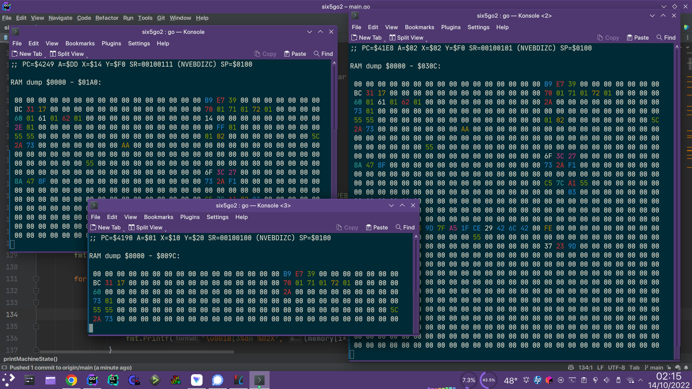

# six5go2

Six5go2 v2.0 - 6502 Emulator and Disassembler in Golang (c) 2022 Zayn Otley

Usage: ./six5go2 [options]

  -allsuitea

        AllSuiteA ROM
  -c64

        C64 ROMs
  -dis

        Disassembler mode (Optional)
  -klausd

        Klaus Dormann's 6502 functional test ROM
  -plus4

        Plus/4 ROMs
  -ruudb

        RuudB's 8K Test ROM
  -trace

        Log Execution Trace to Disk (Optional)

To build the project:

    git clone https://github.com/intuitionamiga/six5go2.git
    cd six5go2
    git checkout v2
    go build -ldflags="-s -w" .

To run the disassembler on the C64 ROMs with machine state displayed:

    ./six5go2 -c64 -state | less

To run the disassembler

    ./six5go2 -c64 -dis | less

           
